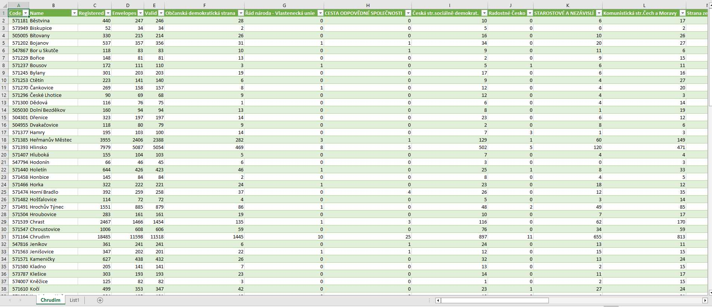

# Project-3 Engeto - Elections Scraper

Project 3 is a scraper that will save the 2017 election results for the selected municipality into a CSV file. The municipality can be selected on the volby.cz website (https://volby.cz/pls/ps2017nss/ps3?xjazyk=CZ).

## Installation

To run scraper you need to install the following libraries:

requests 2.31.0:

    pip install requests

httpx==0.27.0

    pip install httpx

beautifulsoup4 4.12.3

    pip install beautifulsoup4

## Running the script

The script is run with two mandatory arguments. The first is the web page of the municipality and the second is the name of the output CSV file, e.g.

    python Projekt_3.py "https://volby.cz/pls/ps2017nss/ps32?xjazyk=CZ&xkraj=9&xnumnuts=5301" "Chrudim.csv"

sample output for this example:

   
